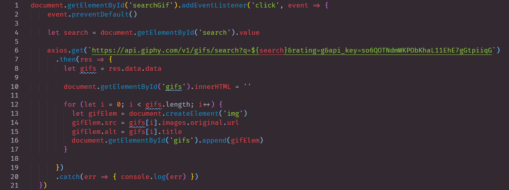

# giphyFinder
## Accessing a 3rd party API in order to render random video's.

> In this repository we used GIPHY for Developers API. Our task was to use an axios.get method.

```
    - AXIOS request is requesting information from an API
    - GIVEN a user wants to find a GIF
    - THEN the user can search for the GIF
    - GIVEN any value in the text input field
    - THEN random GIFs will display depending on text value

```

***Figure One***

 - This is an example of the axios request
 - The axios request goes after the Event Listener
 - The axios request goes before the FOR LOOP
 - Thus, giving the user random gifs 



##                        Home Page


## LINKS

- [jQueryAJAX Link](https://nicholasd-uci.github.io/giphyFinder/)
- [Github Repo Link](https://github.com/nicholasd-uci/giphyFinder)
- [Nicholas Dallas GitHub](https://github.com/nicholasd-uci)

- - -
© 2020 NPRD, Nicholas Paul Ruiz Dallas